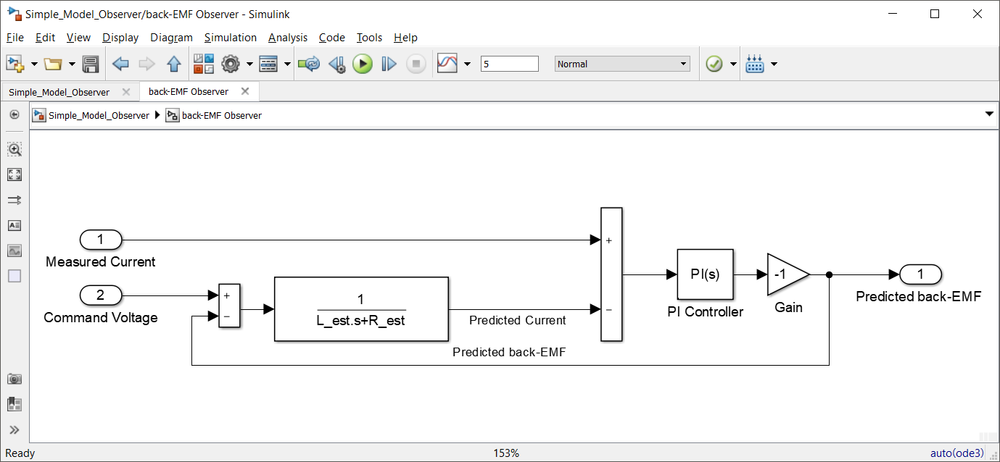
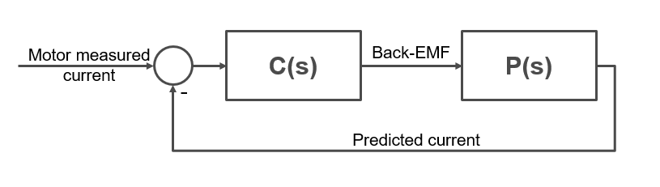
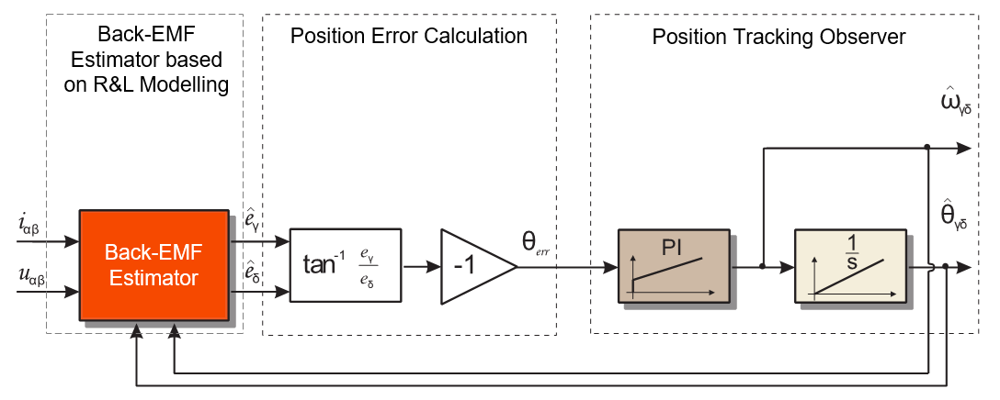

# PMSM Motor SENSOR-LESS METHODS

https://community.nxp.com/t5/Model-Based-Design-Toolbox-MBDT/Module-9-Position-Observer-Part-1-2/m-p/747798

In the technical literature there are a lot of sensor-less control strategies each of them having its own advantages, disadvantages and limitations but if we try to classify these methods we will end up with two major classes: 

1. PMSM model based methods: as the name implies these methods are based on the electrical model of PMSM, and are known to achieve good results in medium and high-speed operation. Due to these limitations the model based methods are mainly used in low-end applications
2. Methods based on PMSM magnetic saliency: are using the magnetic saliency (Ld is different than Lq) inherent characteristic of PMSM.  Such methods are known to achieve good results in standstill or very low speed region and are mainly used for certain type of PMSM motors designed accordingly

## Back-EMF Based Methods

## $\alpha$ $\beta$  axis


$
U_{\alpha } =R_{s}*I_{\alpha }+\frac{\mathrm{d} \Psi_{s\alpha }}{\mathrm{d} t} \\
U_{\beta } =R_{s}*I_{\beta }+\frac{\mathrm{d} \Psi_{s\beta }}{\mathrm{d} t} \\
$\
$
U_{\alpha } =R_{s}*I_{\alpha }+L_{s}*\frac{\mathrm{d} I_{\alpha }}{\mathrm{d} t} -\Psi_{p} \omega_{e} *\sin (\omega_{e}t ) \\
U_{\beta  } =R_{s}*I_{\beta  }+L_{s}*\frac{\mathrm{d} I_{\beta  }}{\mathrm{d} t} +\Psi_{p} \omega_{e} *\cos(\omega_{e}t ) \\
$


$
U_{\alpha}=R_si_s+L_s\frac{di_{\alpha}}{dt}+e_{\alpha } \\
U_{\beta}=R_si_{\beta}+L_s\frac{di_{\beta}}{dt}+e_{\beta  } \\
$\
$
e_{\alpha }=U_{\alpha}-R_si_s-L_s\frac{di_{\alpha}}{dt} \\
e_{\beta  }=U_{\beta}-R_si_{\beta}-L_s\frac{di_{\beta}}{dt} \\
$

$
e_{\alpha } = -\Psi_{p} \omega_{e} *\sin (\theta ) \\
e_{\beta  } =\Psi_{p} \omega_{e} *\cos(\theta ) \\
$


$
\theta=tan^{-1}\frac{e_{\alpha }}{e_{\beta  }}
$

Based on this basic mathematical model there are many other back-EMF based methods which relies on the use of **flux Observers** or **Kalman filters** with the whole purpose to improve the estimation procedure and algorithm stability.<br> Such methods can give good results in the medium and high speed operating region while at low speed rand standstill due to lack of back-EMF produces as consequence of small speed the estimation becomes problematic.<br>  The main limitation of the back-EMF based methods is that it can not be used for sensor-less control of a PMSM in the zero and low speed region (less that $5\%$ rates speed).

Since the measured phased currents are used for back-EMF calculation makes these methods prone to noise influence while the overall accuracy is affected by the motor parameters R, L, flux constant that might vary with the temperature.

## Stator Flux Linkage Based Methods

Another way of estimating the PMSM rotor position is to make use of the stator flux linkage vector.<br> The PMSM stator flux linkage vector is calculated using the rotor reference frame dq voltage equations as shown below 

$
U_d =R_{s}*I_d+\frac{\mathrm{d} \Psi_{d }}{\mathrm{d} t} - \omega_{e} *\Psi_{q } \\
U_q =R_{s}*I_q+\frac{\mathrm{d} \Psi_{q }}{\mathrm{d} t} + \omega_{e} *\Psi_{d }\\
$

$
\Psi_{d}=L_{d}*I_{d}+\Psi_{p} \\
\Psi_{q}=L_{q}*I_{q} \\
$

$
\frac{\mathrm{d} \Psi_{d }}{\mathrm{d} t}=L_{d}*\frac{\mathrm{d} I_{d }}{\mathrm{d} t}\\
\frac{\mathrm{d} \Psi_{q }}{\mathrm{d} t}=L_{q}*\frac{\mathrm{d} I_{q }}{\mathrm{d} t}\\
$

As you can see the phase voltages, currents and resistance must be measured and known in order to calculate the stator fluxes and ultimately the rotor position.<br>

The main issue with this method is cause by the integration processes that might drift over time. Of course we may get rid of this problem by using proper integration methods but still the main limitation as shown for back-EMF remains - the initial rotor position is not detectable with this sensor-less technique

## Observers Based Methods

### Signal Injection Based Methods

These methods are using a high frequency signal that is superimposed on top of the fundamental phase voltage that controls the PMSM. This high frequency signal induces currents which contain information about the rotor position that can be decoded via specialized signal processing techniques.<br>

Such techniques are especially used for sensor-less control of salient pole or interior magnets PMSM types due their high saliency ratio. However, the same technique can be used with surface mounted PMSM since it is going to exploit the saliency produced by the saturation effect of the stator core due to the rotor permanent magnet flux.<br>

 

For the PMSM the magnetic reactance in the d-axis is lower than the one in the q-axis. This is why the magnitude of the current measured in d-axis is higher than the one measured in the q-axis for the same injection voltage signal. The opposite is true for the inductance in the d-axis is lower than the inductance in the q-axis. This effect is caused by the saturation of the magnetic core around d-axis. Based on these observations an accurate observer could be built to harness the effect of magnetic saturation and accurately estimate the speed even at zero speed.<br>

## BEMF Estimation

### PI

$
U_{\alpha}=R_si_\alpha+L_s\frac{di_{\alpha}}{dt}+e_{\alpha } 
          =R_si_\alpha+L_s\frac{di_{\alpha}}{dt}-\Psi_{p} \omega_{e} *\sin (\theta )\\
U_{\beta}=R_si_{\beta}+L_s\frac{di_{\beta}}{dt}+e_{\beta  }
         =R_si_{\beta}+L_s\frac{di_{\beta}}{dt}+\Psi_{p} \omega_{e} *\cos(\theta ) \\
$\
$
U_{\alpha}-e_{\alpha }=R_si_\alpha+L_s\frac{di_{\alpha}}{dt} \\
U_{\beta}-e_{\beta  }=R_si_{\beta}+L_s\frac{di_{\beta}}{dt} \\
$

we can derived the estimated current\
$
\hat{l}=\frac{U_{\alpha}-e_{\alpha }}{\hat{L_s}*S+\hat{R_s}} \\
U_{\beta}-e_{\beta  }=R_si_{\beta}+L_s\frac{di_{\beta}}{dt} \\
$

$
\hat{l}=\frac{U_{\alpha}-e_{\alpha }}{\hat{L_s}*S+\hat{R_s}}
$

Now comes the really interesting part: if we can make the predicted current from Eq. 9 to be equal with the measured current from Eq. 8 then we can have a very good guess of what the back-EMF term is. This equality can only happen if the predicted back-EMF is equal with the real back-EMF generated inside the motor windings.<br>
Fortunately, is quite easy to build such an observer in the Simulink environment using the Eg. 9 and the model below:



As can be seen in Fig. 2, the predicted current is computed based on the difference between the command voltage, the predicted back-EMF and some estimated values for the motor winding resistance and inductance values. Then, the predicted current is compared against the motor phase measured current and the difference is fed into a PI controller that has the job to minimize the error between these 2 currents. If the error is kept to zero by this PI controller then it means that the output of the controller is the exact back-EMF that is produced inside the motor coil. The negative gain is added to stabilize the closed loop around the PI controller.<br>
If we run the simulation and compare the actual back-EMF of a DC motor against the predicted back-EMF we can check how the observer behaves. 

The PI controller within the back-EMF observer can be tuned based on root-locus method as any of PI standard current controller. Starting from Eq. 9, we can depict the process transfer function as a standard 1st order transfer function:

$P(s)=\frac{b}{S+a}$\
$a=\frac{R}{L}$\
$b=\frac{1}{L}$\
PI Controller\
$C(s)=K_p+\frac{K_i}{S}$



The back-EMF observer output, the predicted back-EMF, is shown in the Fig. 5 and compared with the motor back-EMF obtained from simplified motor model. As can be seen, the observer can predict quite accurately the back-EMF. The accuracy of the back-EMF observer is tightly coupled with the PI controller gains. In theory, **the PI controller should be able to deal with R variations due to temperature changes**.

With the cascade transfer function

$G(s)=\frac{C(s)*P(s)}{1+C(s)*P(s)}
     =\frac{b*(K_p*s+K_i)}{s^2+(a+b*K_p)s+b*K_i}
$

Transfer to standard 2nd transfer formula

$s^2+(a+b*K_p)s+b*K_i=s^2+2\xi\omega_0*s+\omega_0^2$

$K_p=\frac{2\xi\omega_0-a}{b}$\
$K_i=\frac{\omega_0^2}{b}$

### PD

$
U_{\alpha}=R_si_s+L_s\frac{di_{\alpha}}{dt}+e_{\alpha } 
          =R_si_s+L_s\frac{di_{\alpha}}{dt}-\Psi_{p} \omega_{e} *\sin (\theta )\\
U_{\beta}=R_si_{\beta}+L_s\frac{di_{\beta}}{dt}+e_{\beta  }
         =R_si_{\beta}+L_s\frac{di_{\beta}}{dt}+\Psi_{p} \omega_{e} *\cos(\theta ) \\
$\
$
U_{\alpha}-e_{\alpha }=R_si_s+L_s\frac{di_{\alpha}}{dt} \\
U_{\beta}-e_{\beta  }=R_si_{\beta}+L_s\frac{di_{\beta}}{dt} \\
$

Laplace input $i_s$ and output $U_\alpha-e_\alpha$, transfer function

$P(s)=\frac{1}{L_s*S+R}=\frac{\frac{1}{L}}{S+\frac{R}{L}}$

$P(s)=\frac{b}{S+a}$\
$a=\frac{R}{L}$\
$b=\frac{1}{L}$


PD Controller\
$C(s)=K_p+K_ds$

$G(s)=\frac{C(s)*P(s)}{1+C(s)*P(s)}
     =\frac{(K_p+K_ds)*\frac{b}{S+a}}{1+(K_p+K_ds)*\frac{b}{S+a}}
     =\frac{K_d(s+\frac{K_p}{K_d})*\frac{b}{S+a}}{1+K_d(s+\frac{K_p}{K_d})*\frac{b}{S+a}}
$

Set
$\frac{K_p}{K_d}=a$

$G(s)=\frac{K_d(s+\frac{K_p}{K_d})*\frac{b}{S+a}}{1+K_d(s+\frac{K_p}{K_d})*\frac{b}{S+a}}
     =\frac{K_d*b}{1+K_d*b}
$

This is how you can build a simple observer using the measured current and command voltage to predict the variation of the back-EMF voltage. At this point we only have one of the back-EMF waveform. Now, we need to find the other back-EMF waveform that corresponds to the orthogonal axis and then using the Eq. 3, to evaluate the rotor position.<br>

 

**So, if up to this point you found this article interesting, lets dig more into the problem an see how can we build a control system around back-EMF observers.**

## Position Tracking Observer

### Theory of operation



### $\gamma \delta$ axes

we are going to consider a new orthogonal virtual frame γδ - gamma/delta which is a rotating coordinate system synchronous with the rotating magnetic field produced in the PMSM. This virtual γδ - gamma/delta frame has the same properties as the standard dq - direct/quadrature coordinate system used for the torque and flux decoupling equations in FOC (check Module 2: PMSM and FOC Theory for more information) but compared with that one is offset by an error angle θerr as shown in Fig. 8


**So, why do we need this new frame γδ - gamma/delta ?**

Well, now comes one of the most important technical aspects of the theory behind this position observer.<br> If you look closely at the frames depicted in Fig. 8, something interesting happens if $\gamma\delta$ is perfectly aligned with dq frame. If the error angle $\theta_{err}$ is zero than all the saliency back-EMF, generated by the rotating magnets, is located in the $\delta$-delta axis which is in fact same as the q axis and this means that there is no error between real and estimated position.<br>
**This is the quintessence of the whole position estimation mechanism.**


 

On the other hand, if error angle θerr exists then, the γ-gamma axis also see saliency back-EMF, therefore the back-EMF voltage can be our cost-function that needs to be optimized towards zero by help of a simple PI controller.

 

Therefore, from now on we are going to use this γδ - gamma/delta frame to perform all the computations related to position observer. Considering the Eq.1, we can rewrite the PMSM model in the γδ - gamma/delta as:

$
U_d =R_{s}*I_d+\frac{\mathrm{d} \psi_{d }}{\mathrm{d} t} - \omega_{e} *\psi_{q } \\
U_q =R_{s}*I_q+\frac{\mathrm{d} \psi_{q }}{\mathrm{d} t} + \omega_{e} *\psi_{d }\\
$

$$
U_{\gamma} =R_{s}*I_{\gamma}+L_{d}*\frac{\mathrm{d} I_{\gamma }}{\mathrm{d} t}-\omega_{\gamma\delta}*L_q*I_{\delta}-K_v\omega_{\gamma\delta}sin(\theta_{err}) \tag{1}\hspace{10cm}
$$
$$
U_{\delta} =R_{s}*I_{\delta}+L_{d}*\frac{\mathrm{d} I_{\delta }}{\mathrm{d} t}+\omega_{\gamma\delta}*L_q*I_{\gamma}+K_v\omega_{\gamma\delta}cos(\theta_{err}) \tag*{1}\hspace{10cm}
$$


$
    \begin{bmatrix}
        U\gamma\\
        U\delta \\
    \end{bmatrix}
    =
    \begin{bmatrix}
        R+s*L_d                     & -\omega_{\gamma\delta}L_q\\
        \omega_{\gamma\delta}L_q    &  R+s*L_d\\
    \end{bmatrix}*
    \begin{bmatrix}
        I_{\gamma} \\
        I_{\delta} \\
    \end{bmatrix}+K_v\omega_{\gamma\delta}
     \begin{bmatrix}
        -sin(\theta_{err}) \\
        cos(\theta_{err}) \\
    \end{bmatrix}
$ 


* $R$ is the resistance of one stator phase $[\Omega]$,
* $L_d$ and $L_q$ are the d-axis and q-axis inductances $[H]$,
* $\omega_{\gamma\delta}$ is the estimated electrical angular velocity of the rotor $[rad/s]$,
* $U_{\gamma}$ and $U_{\delta}$ are the stator voltages $[V]$,
* $I\gamma$ and $I\delta$ are the stator currents $[A]$,
* $K_v*\omega_{\gamma\delta}$  is the saliency-based BEMF magnitude $[V]$
* $\theta_{err}$ is the phase error between the estimated quasi-synchronous frame $\gamma\delta$ and the synchronous rotor flux frame dq $[rad]$,
* $s$ is the Laplace differential operator.

Please note that in Equation,<font color=Green> the voltage in the δ-axis is computed from the ***Ld inductance instead of Lq.*** This helps us to ***avoid the motor parameters measurement errors of the R and Ld parameters.***</font> This is yet another reason for selecting this implementation of saliency based back-EMF since position estimation accuracy depends only on one parameter until the field weakening region. The only parameter that needs to be known/measured beforehand is Lq. All other model based approaches methods depends on 2 or 3 of the motor parameters (Rs,Ld,Lq)

PMSM Electrical Parameters Measurement

So the output of the back-EMF estimator are the saliency back-EMF voltages in $\gamma\delta$ error frame and we already know that we need to optimize the $\gamma$-gamma component to be zero or better to say the angle error $\theta_{err}$ between $\gamma\delta$ error frame and the dq frame to be zero. 

As shown in Fig. 7, with the help of tangent function we can obtain directly the angle error $\theta_{err}$ between $\gamma\delta$ error frame and the dq frame which can be directly optimized to zero by a third PI controller (the first two of PI controller are inside the back-EMF estimator). This PI controller is part of what we call a Position Tracking Observer.

If the angle error $\theta_{err}$  between $\gamma\delta$ error frame and the dq frame is zero then we also have the correct position on the output of the Position Tracking Observer and on the output of PI controller there must be the correct speed.

### back-EMF Estimator

The back-EMF estimator (others might call it back-EMF observer but for the sake of avoiding term overlapping with Position Observer, i'll refer to it as estimator) job is to detect the voltages induced by the permanent magnets of a PMSM in this newly introduced quasi-synchronous γδ reference frame. The estimated back-EMF quantities allows the estimation of the rotor speed and position.

As depicted in Fig. 9 with orange blocks, for readability I broke the back-EMF estimator into 3 Simulink subsystems:


* ***AlphaBeta2GammaDelta*** subsystem projects the real current and voltages into the quasi-synchronous frame
* ***RL_Circuit_Model*** subsystem implements the PMSM model that is used to predict the currents in the quasi-synchronous frame
* ***backEMF_Estimator*** implements the PI controllers that computes the back-EMF quatities in the quasi-synchronous frame 

#### $\alpha\beta2\gamma\delta$ Transformations

The input voltages and currents are supplied in a stationary reference frame αβ. The back-EMF estimator, transforms these quantities into a quasi-synchronous reference frame γδ that follows the real synchronous rotor flux frame dq with an error θerr. These transformations are shown in Fig. 10, and as can be seen this is nothing more that a simple PARK transformation in which the angle used for sine/cosine computations is the one predicted by the Position Observer

Also, please note that all the inputs are converted from floating point single precision to fixed point 16 bit numbers using dedicate AMMCLIB conversion block. In case of the current we also need to scale the values to (-1, 1) interval using a simple divide with the ADC maximum measurable current value. As shown in Fig. 11, even if we changed the numeric representation the currents and voltages continue to have the variation we expect from a FOC. The scaling factor is easy to be deducted is we consider that at 2^15 we get the maximum current of 31.25Amps or maximum voltage of 12Volts.

#### Modelling the RL circuit used to predict the currents

As we learned from the DC motor back-EMF estimation exercise, in order to be able to predict these two back-EMF components Eγ and Eδ we need a way to predict the current iγ and iδ using a mathematical model of the PMSM. The key of back-EMF estimator is to create a closed loop system consisting of a model of R-L circuit which represents the motor winding and a PI controller with an output referring to the back-EMF signals.

 

In case of Fig. 2 we have used a basic first order transfer function to simulate the RL circuit in continuous time domain but now since we are dealing with a model that needs to be computed at each FOC sample loop, we need to find a suitable model that can be implemented on the MCU.

 

Starting from Eq. 15, lets start to write the equations for the predicted currents in γδ axes. First lets get rid of the matrix from and write them as a system of equations:


$
    \begin{bmatrix}
        U\gamma\\
        U\delta \\
    \end{bmatrix}
    =
    \begin{bmatrix}
        R+s*L_d                     & -\omega_{\gamma\delta}L_q\\
        \omega_{\gamma\delta}L_q    &  R+s*L_d\\
    \end{bmatrix}*
    \begin{bmatrix}
        I_{\gamma} \\
        I_{\delta} \\
    \end{bmatrix}+K_v\omega_{\gamma\delta}
     \begin{bmatrix}
        -sin(\theta_{err}) \\
        cos(\theta_{err}) \\
    \end{bmatrix}
$ 


$
U_{\gamma} =R_{s}*I_{\gamma}+L_{d}*\frac{\mathrm{d} I_{\gamma }}{\mathrm{d} t}-\omega_{\gamma\delta}*L_q*I_{\delta}-K_v\omega_{\gamma\delta}sin(\theta_{err})\\
U_{\delta} =R_{s}*I_{\delta}+L_{d}*\frac{\mathrm{d} I_{\delta }}{\mathrm{d} t}+\omega_{\gamma\delta}*L_q*I_{\gamma}+K_v\omega_{\gamma\delta}cos(\theta_{err})\\
$

$
e_\gamma(t)=K_v\omega_{\gamma\delta}sin(\theta_{err})\\
e_\delta(t)=K_v\omega_{\gamma\delta}cos(\theta_{err})
$

$
U_{\gamma}(t) =R_{s}*I_{\gamma}(t)+L_{d}*\frac{\mathrm{d} I_{\gamma }}{\mathrm{d} t}-\omega_{\gamma\delta}(t)*L_q*I_{\delta}(t)-e_\gamma(t)\\
U_{\delta}(t) =R_{s}*I_{\delta}(t)+L_{d}*\frac{\mathrm{d} I_{\delta }}{\mathrm{d} t}+\omega_{\gamma\delta}(t)*L_q*I_{\gamma}(t)+e_\delta(t)\\
$


If we rearrange the Eq. 18 in order to highlight the derivative terms for each current in  γδ axes we will obtain a system of differential equations:

$
L_{d}*\frac{\mathrm{d} I_{\gamma }}{\mathrm{d} t}=U_{\gamma}(t)-R_{s}*I_{\gamma}(t)+\omega_{\gamma\delta}(t)*L_q*I_{\delta}(t)+e_\gamma(t) \\
L_{d}*\frac{\mathrm{d} I_{\delta }}{\mathrm{d} t}=U_{\delta}(t)-R_{s}*I_{\delta}(t)- \omega_{\gamma\delta}(t)*L_q*I_{\gamma}(t)-e_\delta(t)\\
$\
$
\frac{\mathrm{d} I_{\gamma }}{\mathrm{d} t}=\frac{1}{L_{d}}(U_{\gamma}(t)-R_{s}*I_{\gamma}(t)+\omega_{\gamma\delta}(t)*L_q*I_{\delta}(t)+e_\gamma(t) )\\
\frac{\mathrm{d} I_{\delta }}{\mathrm{d} t}=\frac{1}{L_{d}}(U_{\delta}(t)-R_{s}*I_{\delta}(t)- \omega_{\gamma\delta}(t)*L_q*I_{\gamma}(t)-e_\delta(t))\\
$


#### Forward Eular

$
\frac{\mathrm{d} I_{\gamma }}{\mathrm{d} t}=\frac{1}{L_{d}}(U_{\gamma}(t)-R_{s}*I_{\gamma}(t)+\omega_{\gamma\delta}(t)*L_q*I_{\delta}(t)+e_\gamma(t) )\\
$\
$
\frac{I_{\gamma(k)}- I_{\gamma(k-1)}}{\mathrm{d} t}=\frac{1}{L_{d}}(U_{\gamma}(k)-R_{s}*I_{\gamma}(k)+\omega_{\gamma\delta}(k)*L_q*I_{\delta}(k)+e_\gamma(k) )\\
$
$\begin{aligned}
I_{\gamma(k)}&=\frac{\mathrm{d} t}{L_{d}}(U_{\gamma}(k)-R_{s}*I_{\gamma}(k)+\omega_{\gamma\delta}(k)*L_q*I_{\delta}(k)+e_\gamma(k) )+I_{\gamma(k-1)}\\
&=\frac{\mathrm{d} t}{L_{d}}U_{\gamma}(k)-\frac{\mathrm{d} t}{L_{d}}R_{s}*I_{\gamma}(k)+\frac{\mathrm{d} t}{L_{d}}*L_q*\omega_{\gamma\delta}(k)*I_{\delta}(k)+\frac{\mathrm{d} t}{L_{d}}e_\gamma(k)+I_{\gamma(k-1)}
\end{aligned}\\
$


$
I_{\gamma(k)}+\frac{\mathrm{d} t}{L_{d}}R_{s}*I_{\gamma}(k)=\frac{\mathrm{d} t}{L_{d}}U_{\gamma}(k)+\frac{\mathrm{d} t}{L_{d}}*L_q*\omega_{\gamma\delta}(k)*I_{\delta}(k)+\frac{\mathrm{d} t}{L_{d}}e_\gamma(k)+I_{\gamma(k-1)}\\
$


$
(1+\frac{\mathrm{d} t}{L_{d}}R_{s})*I_{\gamma}(k)=\frac{\mathrm{d} t}{L_{d}}U_{\gamma}(k)+\frac{\mathrm{d} t}{L_{d}}*L_q*\omega_{\gamma\delta}(k)*I_{\delta}(k)+\frac{\mathrm{d} t}{L_{d}}e_\gamma(k)+I_{\gamma(k-1)}\\
$

$
(L_{d}+d_t*R_{s})*I_{\gamma}(k)=d_tU_{\gamma}(k)+d_t*L_q*\omega_{\gamma\delta}(k)*I_{\delta}(k)+d_te_\gamma(k)+L_{d}I_{\gamma(k-1)}\\
$

$
I_{\gamma}(k)=\frac{d_t}{L_{d}+d_t*R_{s}}U_{\gamma}(k)+\frac{d_t*L_q}{L_{d}+d_t*R_{s}}*\omega_{\gamma\delta}(k)*I_{\delta}(k)+\frac{d_t}{L_{d}+d_t*R_{s}}e_\gamma(k)+\frac{L_{d}}{L_{d}+d_t*R_{s}}I_{\gamma(k-1)}\\
$

$
I_{\gamma}(k)=U_{gain}*U_{\gamma}(k)+WI_{gain}*\omega_{\gamma\delta}(k)*I_{\delta}(k)+E_{gain}*e_\gamma(k)+I_{gain}*I_{\gamma(k-1)}\\
$

$
I_{gain}=\frac{L_{d}}{L_{d}+d_t*R_{s}}\\
$

$
U_{gain}=\frac{d_t}{L_{d}+d_t*R_{s}}\\
$


$
WI_{gain}=\frac{d_t*L_q}{L_{d}+d_t*R_{s}}\\
$

$
E_{gain}=\frac{d_t}{L_{d}+d_t*R_{s}}\\
$

$-\frac{\hat{E}_{\gamma\delta}(s)}{E_{\gamma\delta}(s)}=\frac{sK_p+K_i}{s^2L_D+sR_s+sK_P+K_i}$\
$s^2L_D+sR_s+sK_P+K_i=s^2+2\xi\omega_0s+\omega_0^2$

#### Trapezoidal Approximation

$
U_{\gamma}(t)= R_{s}*I_{\gamma}(t)+L_{d}*\frac{\mathrm{d} I_{\gamma }}{\mathrm{d} t}-\omega_{\gamma\delta}(t)*L_q*I_{\delta}(t)-K_v\omega_{\gamma\delta}sin(\theta_{err})\\
U_{\delta}(t)=R_{s}*I_{\delta}(t)+L_{d}*\frac{\mathrm{d} I_{\delta }}{\mathrm{d} t}+ \omega_{\gamma\delta}(t)*L_q*I_{\gamma}(t)+K_v\omega_{\gamma\delta}cos(\theta_{err})\\
$\
$
U_{\gamma}(t)= R_{s}*I_{\gamma}(t)+L_{d}*\frac{\mathrm{d} I_{\gamma }}{\mathrm{d} t}-\omega_{\gamma\delta}(t)*L_q*I_{\delta}(t)-e_{\gamma}(t)\\
U_{\delta}(t)=R_{s}*I_{\delta}(t)+L_{d}*\frac{\mathrm{d} I_{\delta }}{\mathrm{d} t}+ \omega_{\gamma\delta}(t)*L_q*I_{\gamma}(t)+e_{\delta}(t)\\
$\
$e_{\gamma}(t)=K_v\omega_{\gamma\delta}sin(\theta_{err})\\
e_{\delta}(t)=K_v\omega_{\gamma\delta}cos(\theta_{err})
$


$
L_{d}*\frac{\mathrm{d} I_{\gamma }}{\mathrm{d} t}=U_{\gamma}(t)-R_{s}*I_{\gamma}(t)+\omega_{\gamma\delta}(t)*L_q*I_{\delta}(t)+e_\gamma(t) \\
L_{d}*\frac{\mathrm{d} I_{\delta }}{\mathrm{d} t}=U_{\delta}(t)-R_{s}*I_{\delta}(t)- \omega_{\gamma\delta}(t)*L_q*I_{\gamma}(t)-e_\delta(t)\\
$\
$
\frac{\mathrm{d} I_{\gamma }}{\mathrm{d} t}=\frac{1}{L_{d}}(U_{\gamma}(t)-R_{s}*I_{\gamma}(t)+\omega_{\gamma\delta}(t)*L_q*I_{\delta}(t)+e_\gamma(t) )\\
\frac{\mathrm{d} I_{\delta }}{\mathrm{d} t}=\frac{1}{L_{d}}(U_{\delta}(t)-R_{s}*I_{\delta}(t)- \omega_{\gamma\delta}(t)*L_q*I_{\gamma}(t)-e_\delta(t))\\
$


$
\frac{\mathrm{d} I_{\gamma }}{\mathrm{d} t}=\frac{1}{L_{d}}(U_{\gamma}(t)-R_{s}*I_{\gamma}(t)+L_q*\omega_{\gamma\delta}(t)*I_{\delta}(t)+e_\gamma(t) )\\
$

$\begin{aligned}
I_{\gamma(k)}
&=\frac{d_t}{2}\frac{1}{L_{d}}(U_{\gamma}(k)+U_{\gamma}(k-1))\\
&-\frac{d_t}{2}\frac{1}{L_{d}}R_s*(I_{\gamma}(k)+I_{\gamma}(k-1))\\
&+\frac{d_t}{2}\frac{1}{L_{d}}L_q*(\omega_{\gamma\delta}(k)*I_{\delta}(k)+\omega_{\gamma\delta}(k-1)*I_{\delta}(k-1))\\
&+\frac{d_t}{2}\frac{1}{L_{d}}(e_\gamma(k) +e_\gamma(k-1))\\
&+I_{\gamma(k-1)}\\\end{aligned}
$

$\begin{aligned}
I_{\gamma(k)}+\frac{d_t}{2}\frac{1}{L_{d}}R_s*I_{\gamma}(k)
&=\frac{d_t}{2}\frac{1}{L_{d}}(U_{\gamma}(k)+U_{\gamma}(k-1))\\
&+\frac{d_t}{2}\frac{1}{L_{d}}L_q*(\omega_{\gamma\delta}(k)*I_{\delta}(k)+\omega_{\gamma\delta}(k-1)*I_{\delta}(k-1))\\
&+\frac{d_t}{2}\frac{1}{L_{d}}(e_\gamma(k) +e_\gamma(k-1))\\
&+(1-\frac{d_t}{2}\frac{1}{L_{d}}R_s)*I_{\gamma}(k-1)
\end{aligned}
$

$\begin{aligned}
(2*L_d+d_tR_s)I_{\gamma(k)}
&=d_t(U_{\gamma}(k)+U_{\gamma}(k-1))\\
&+d_tL_q*(\omega_{\gamma\delta}(k)*I_{\delta}(k)+\omega_{\gamma\delta}(k-1)*I_{\delta}(k-1))\\
&+d_t(e_\gamma(k) +e_\gamma(k-1))\\
&+(2L_d-R_sd_t)*I_{\gamma}(k-1)
\end{aligned}
$

$\begin{aligned}
I_{\gamma(k)}
&=\frac{d_t}{2*L_d+d_tR_s}(U_{\gamma}(k)+U_{\gamma}(k-1))\\
&+\frac{d_tL_q}{2*L_d+d_tR_s}*(\omega_{\gamma\delta}(k)*I_{\delta}(k)+\omega_{\gamma\delta}(k-1)*I_{\delta}(k-1))\\
&+\frac{d_t}{2*L_d+d_tR_s}(e_\gamma(k) +e_\gamma(k-1))\\
&+\frac{2L_d-R_sd_t}{2*L_d+d_tR_s}*I_{\gamma}(k-1)
\end{aligned}
$

$
\begin{aligned}
I_{\gamma}(k)&=
            U_{gain}(U_{\gamma}(k)+U_{\gamma}(k-1))\\
            &+WI_{gain}(\omega_{\gamma\delta}(k)*I_{\delta}(k)+\omega_{\gamma\delta}(k-1)*I_{\delta}(k-1))\\
            &+E_{gain}(e_{\gamma}(k)+e_{\gamma}(k-1))\\
            &+I_{gain}I_{\gamma}(k-1)
\end{aligned}
$


$U_{gain} = \frac{T_s}{2*L_d+T_s*R_s}$

$WI_{gain} = \frac{T_s*L_q}{2*L_d+T_s*R_s}$

$E_{gain} = \frac{T_s}{2*L_d+T_s*R_s}$

$I_{gain} = \frac{2*L_d-T_s*R_s}{2*L_d+T_s*R_s}$

$
\frac{\mathrm{d} I_{\delta }}{\mathrm{d} t}=\frac{1}{L_{d}}(U_{\delta}(t)-R_{s}*I_{\delta}(t)- \omega_{\gamma\delta}(t)*L_q*I_{\gamma}(t)-e_\delta(t))\\
$

$
\begin{aligned}
I_{\gamma}(k)&=
            U_{gain}(U_{\gamma}(k)+U_{\gamma}(k-1))\\
            &-WI_{gain}(\omega_{\gamma\delta}(k)*I_{\delta}(k)+\omega_{\gamma\delta}(k-1)*I_{\delta}(k-1))\\
            &+E_{gain}(e_{\gamma}(k)+e_{\gamma}(k-1))\\
            &+I_{gain}I_{\gamma}(k-1)
\end{aligned}
$


$\begin{aligned}
I_{\delta(k)}
&=\frac{d_t}{2}\frac{1}{L_{d}}(U_{\delta}(k)+U_{\delta}(k-1))\\
&-\frac{d_t}{2}\frac{1}{L_{d}}R_s*(I_{\delta}(k)+I_{\delta}(k-1))\\
&+\frac{d_t}{2}\frac{1}{L_{d}}L_q*(\omega_{\gamma\delta}(k)*I_{\gamma}(k)+\omega_{\gamma\delta}(k-1)*I_{\gamma}(k-1))\\
&-\frac{d_t}{2}\frac{1}{L_{d}}(e_\delta(k) +e_\delta(k-1))\\
&+I_{\delta(k-1)}\\\end{aligned}
$

$\begin{aligned}
I_{\delta(k)}+\frac{d_t}{2}\frac{1}{L_{d}}R_s*I_{\delta}(k)
&=\frac{d_t}{2}\frac{1}{L_{d}}(U_{\gamma}(k)+U_{\gamma}(k-1))\\
&+\frac{d_t}{2}\frac{1}{L_{d}}L_q*(\omega_{\gamma\delta}(k)*I_{\delta}(k)+\omega_{\gamma\delta}(k-1)*I_{\delta}(k-1))\\
&+\frac{d_t}{2}\frac{1}{L_{d}}(e_\gamma(k) +e_\gamma(k-1))\\
&+(1-\frac{d_t}{2}\frac{1}{L_{d}}R_s)*I_{\gamma}(k-1)
\end{aligned}
$

 ## Position Tracking Observer

Transfer Function(Refer Page 239 Figure 78 "MPC574XPMCLUG.pdf")


$\begin{aligned}
G(s)
&=\frac{(K_p+K_i\frac{1}{s})\frac{1}{s}}{1+(K_p+K_i\frac{1}{s})\frac{1}{s}}\\
&=\frac{K_ps+K_i}{s^2+K_ps+K_i}
\end{aligned}$


$G(s)=\frac{\theta_{estim}(s)}{\theta_e(s)}=\frac{K_ps+K_i}{s^2+K_ps+K_i}$

Standard 2nd transfer function \
$G(s)=\frac{1}{s^2+2*\xi*\omega_0s+\omega_0^2}$


```python

```

$K_i=\omega_0^2=(2*\pi*f_0)^2$ \
$K_p=2*\xi*\omega_0=4\pi*\xi*f_0$

#### Discrete digital control system
