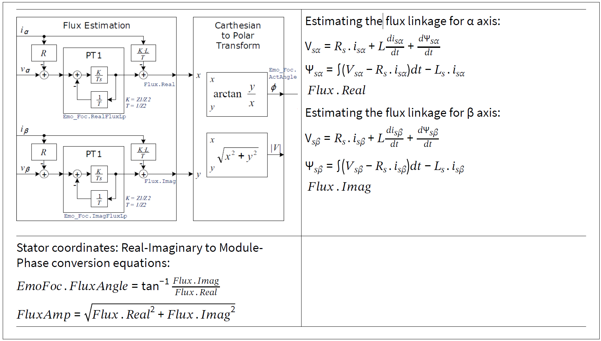
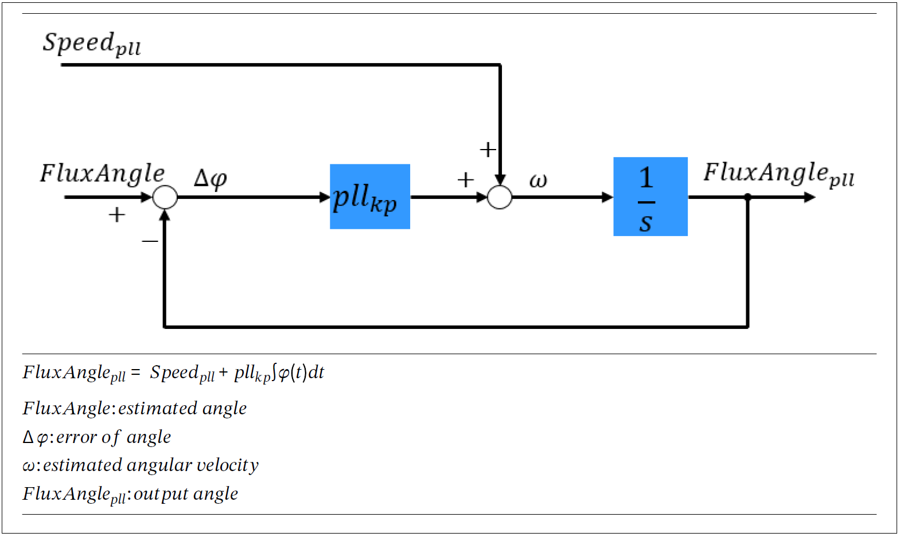

# PMSM Estimation Flux

## Flux Estimation

$
\Psi_{p\alpha }=\Psi_{p} *\cos(\omega_{e}t ) \\
\Psi_{p\beta } =\Psi_{p} *\sin(\omega_{e}t ) \\
$

$
\theta =\arctan(\frac{\Psi_{p\alpha }}{\Psi_{p\beta}}) \\
$

$
\Psi_{p\alpha }=\Psi_{p} *\cos(\theta ) \\
\Psi_{p\beta } =\Psi_{p} *\sin(\theta ) \\
$

$
\Psi_{s\alpha }=L_s*I_{\alpha }+\Psi_{p\alpha } \\
\Psi_{s\beta } =L_s*I_{\beta }+\Psi_{p\beta } \\
$

$
U_{\alpha } =R_{s}*I_{\alpha }+\frac{\mathrm{d} \Psi_{s\alpha }}{\mathrm{d} t} \\
U_{\beta } =R_{s}*I_{\beta }+\frac{\mathrm{d} \Psi_{s\beta }}{\mathrm{d} t} \\
$

$
\Psi_{s\alpha }=\int(U_{\alpha }-R_{s}*I_{\alpha })dt \\
\Psi_{s\beta }=\int(U_{\beta }-R_{s}*I_{\beta })dt \\
$

$
\Psi_{p\alpha }= \Psi_{s\alpha }-L_s*I_{\alpha }\\
\Psi_{p\beta }=\Psi_{s\beta } -L_s*I_{\beta } \\
$

Flux . Real \
$
\Psi_{p\alpha }= \int(U_{\alpha }-R_{s}*I_{\alpha })dt-L_s*I_{\alpha }\\
$\
Flux . Imag \
$
\Psi_{p\beta }=\int(U_{\beta }-R_{s}*I_{\beta })dt -L_s*I_{\beta } \\
$\
Flux Angle \
$
\theta =\arctan(\frac{\Psi_{p\alpha }}{\Psi_{p\beta}}) \\
$\
Flux Amp \
$
FluxAmp =\sqrt{(\Psi_{p\alpha })^2+(\Psi_{p\beta })^2 }  \\
$

From "Sensorless Field Oriented Control with Embedded Power SoC" TLE9879

### Angle PLL Observer

The main purpose of the PLL is to stabilize the angle position during the next PWM cycle based on measured
angle position, last known angle position and estimated speed. As shown in Equation 30, the PLL is
implemented via a regulation loop, which filters the angle output. \
The P-Controller of the PLL should be dimensioned as follows: fast enough to follow the maximum expected
system dynamics, but slow enough to filter out angle errors caused by high frequency disturbances. Getting an
optimal solution to this problem usually requires testing on the complete system.

Flux Observer
1. Closed-loop flux observer
2. first order sliding mode observer
3. second order sliding mode observer
4. first-order sliding mode observer in dq-reference frame 

Two compensation methods
1. a VSI voltage error compensator,
2. a feedforward load torque compensator are introduced

$K_p$

英飞凌的PLL Estimator\
在英飞凌的Eval-M1-1302开发套件中也有一套无位置传感器控制方案，具体细节也是不知道，但是使用手册上有这么一句话：
PLL Estimator, the sensorless feedback mechanism which requires only one motor parameter – stator inductance L, for rotor speed and position feedback
从这句话来看，该观测器用到了PLL，且只需要电机的电感参数，更多细节就不知道了，相关代码也是闭源的。
