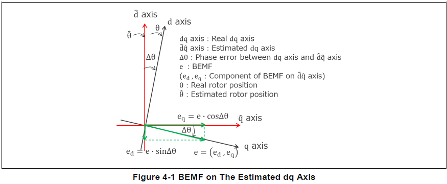
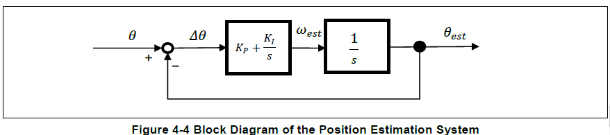

# Renesas PMSM Estimation

* Renesas R01AN3786EJ0102 Rev.1.02 Oct. 31,2018
* Renesas BEMF estimator is almost same as NXP estimator
  * Renesas estimate $\gamma \delta$ asix BEMF
  * NXP estimate $\gamma \delta$ asix flux

### D Q Voltage

$
U_d =R_{s}*I_d+\frac{\mathrm{d} \Psi_{d }}{\mathrm{d} t} - \omega_{e} *\Psi_{q } \\
U_q =R_{s}*I_q+\frac{\mathrm{d} \Psi_{q }}{\mathrm{d} t} + \omega_{e} *\Psi_{d }\\
$

$
U_d =R_{s}*I_d+L_{d}*\frac{\mathrm{d} I_{d }}{\mathrm{d} t} - \omega_{e} *L_{q}*I_{q} \\
U_q =R_{s}*I_q+L_{q}*\frac{\mathrm{d} I_{q }}{\mathrm{d} t} + \omega_{e} *(L_{d}*I_{d}+\Psi_{p})\\
$

* ***DQ Axes***\
$T_e=\frac{3}{2}n_p[\Psi_p*i_q+(L_d-L_q)i_d*i_q]$
* ***Mechnical Torque***\
$T_e=T_l+B*\omega_m+J*\frac{d}{dt}\omega_m$

## BEMF Estimation

$U_d^\ast=(R+sL_d)I_d-\omega^\ast L_qI_q+e_d$\
$U_q^\ast=(R+sL_q)I_q-\omega^\ast L_dI_d+e_q$
* Furthermore, by considering $−\omega^\ast L_qI_q+e_d$ and $\omega^\ast L_dI_d+e_q$ as the voltage disturbance, they are written as $-d_d$  $-d_q$ respectively.

$U_d^\ast=(R+sL_d)I_d-d_d$\
$U_q^\ast=(R+sL_q)I_q-d_q$

### d-Axis

d-axis q-axis voltage equation is rewritten as follows

$sI_d=\frac{U_d^\ast}{L_d}-\frac{R}{L_d}I_d+\frac{d_d}{L_d}$\
$sd=sd_d$

If the estimated $Id$ is $\hat{I_d}$ and the estimated $d$ is $\hat{d}$, the estimated state equation is written as follows.\
$K_{Ed1}$ and $K_{Ed2}$ are estimation gains

$s\hat{l_{d}}=-\frac{R}{L_d}\hat{l_{d}}+\frac{\hat{d}}{L_d}+\frac{U_d^\ast}{L_d}+K_{Ed1}(I_d-\hat{I_d})$\
$s\hat{d}=K_{Ed2}(I_d-\hat{l_d})$

$\hat{l_d}=\frac{\frac{K_{Ed2}}{L_d}}{s^2+(\frac{R}{L_d}+K_{Ed1})s+\frac{K_{Ed2}}{L_d}} \{ (1+\frac{K_{Ed1}}{K_{Ed2}}L_d s)I_d+\frac{s}{K_{Ed2}}U_d^\ast \} $

$\hat{d}=\hat{d_d}=\frac{\frac{K_{Ed2}}{L_d}}{s^2+(\frac{R}{L_d}+K_{Ed1})s+\frac{K_{Ed2}}{L_d}} \{ (L_d s+R)I_d-U_d^\ast \}$

$\omega_n=\sqrt{\frac{K_{Ed2}}{L_d}}$

$\xi=\frac{\frac{R}{L_d}+K_{Ed1}}{2\sqrt{\frac{K_{Ed2}}{L_d}}}$

$K_{Ed1}=2\xi_{EG} \omega_{EG}-\frac{R}{L_d}$

$K_{Ed2}=\omega_{EG}^2L_d$

* $\omega_{EG}$ : Desired natural frequency of BEMF estimation system
* $\xi_{EG}$ :Desired damping ratio of BEMF estimation system

Furthermore, the estimated state equation is rewritten as follows.

$\hat{l_d}=\frac{1}{s} \{-\frac{R}{L_d}\hat{l_d}+\frac{\hat{d_d}}{L_d}+\frac{U_d\ast}{L_d}+K_{Ed1}(I_d-\hat{l_d})\} $

$\hat{d_d}=\frac{1}{s} \{K_{Ed2}(I_d-\hat{l_d})\} $

### q-Axis

$sI_q=\frac{U_q^\ast}{L_q}-\frac{R}{L_q}I_q+\frac{d_q}{L_q}$\
$sq=sd_q$

$\hat{l_q}=\frac{\frac{K_{Eq2}}{L_q}}{s^2+(\frac{R}{L_q}+K_{Eq1})s+\frac{K_{Eq2}}{L_q}} \{ (1+\frac{K_{Eq1}}{K_{Eq2}}L_q s)I_q+\frac{s}{K_{Eq2}}U_q^\ast \} $

$\hat{d}=\hat{d_q}=\frac{\frac{K_{Eq2}}{L_q}}{s^2+(\frac{R}{L_q}+K_{Eq1})s+\frac{K_{Eq2}}{L_q}} \{ (L_q s+R)I_q-U_q^\ast \}$

$\omega_n=\sqrt{\frac{K_{Eq2}}{L_q}}$

$\xi=\frac{\frac{R}{L_q}+K_{Eq1}}{2\sqrt{\frac{K_{Eq2}}{L_q}}}$

$K_{Eq1}=2\xi_{EG} \omega_{EG}-\frac{R}{L_q}$

$K_{Eq2}=\omega_{EG}^2L_q$

* $\omega_{EG}$ : Desired natural frequency of BEMF estimation system
* $\xi_{EG}$ :Desired damping ratio of BEMF estimation system

Furthermore, the estimated state equation is rewritten as follows.

$\hat{l_q}=\frac{1}{s} \{-\frac{R}{L_q}\hat{l_q}+\frac{\hat{d_q}}{L_q}+\frac{U_q\ast}{L_q}+K_{Eq1}(I_q-\hat{l_q})\} $

$\hat{d_q}=\frac{1}{s} \{K_{Eq2}(I_q-\hat{l_q})\} $

BEMF is calculated from the estimated voltage disturbance $\hat{d_d}$ $\hat{d_q}$ as follows

$e_d=-\hat{d_d}+\omega^\ast L_q I_q$

$e_q=-\hat{d_d}-\omega^\ast L_d I_d$

$\Delta \theta=atan(\frac{e_d}{e_q})$

As shown in the above equations, the phase error between the real axis and the estimated axis are calculated

According to the above block diagram, the closed-loop transfer function of this system is

$\frac{\theta_{est}(s)}{\theta(s)}=\frac{K_i(s\frac{K_p}{K_i}+1)}{s^2+K_p s+K_i}$

This system is a 2nd order lag system. The natural frequency $\omega_m$ , damping ratio $\xi$ are written as follows.

$\omega_n=\sqrt{K_i}$

$\xi=\frac{K_p}{2\sqrt{K_i}}$

The control gains of this system ($K_{P\_phase\_error}$ , $K_{𝐼\_phase𝑒\_error}$) are written as follows

$K_{P\_phase\_error}=2\xi_{\Delta\theta}\omega_{\Delta\theta}$

$L_{I\_phase\_error}=\omega_{\Delta\theta}^2$

* $\omega_{\Delta\theta}$: Desired natural frequency of position estimation system
* $\xi_{\Delta\theta}$: Desired damping ratio of position estimation system
