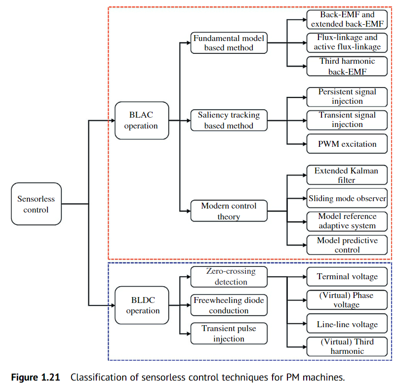
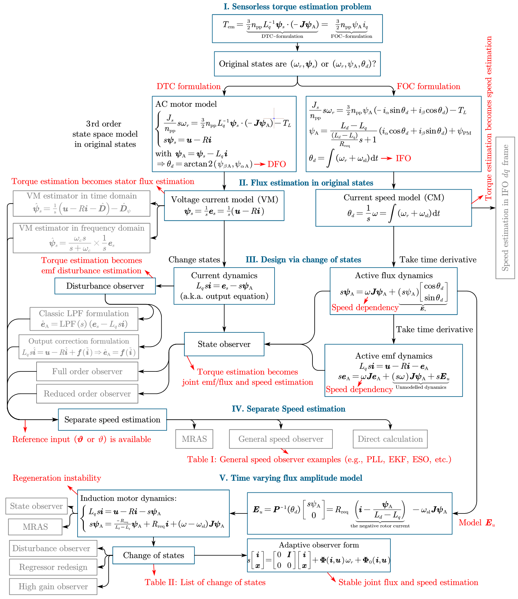

- [1. Sensorless control methods](#1-sensorless-control-methods)
  - [1.1. Introduction](#11-introduction)
  - [1.2. Drives](#12-drives)
  - [1.3. Basic Principle of PM BLAC (PMSM) Drives](#13-basic-principle-of-pm-blac-pmsm-drives)
    - [1.3.1. Modeling](#131-modeling)
      - [1.3.1.1. ABC Reference Frame](#1311-abc-reference-frame)
      - [1.3.1.2. Stationary Reference Frame](#1312-stationary-reference-frame)
      - [1.3.1.3. Synchronous Reference Frame](#1313-synchronous-reference-frame)
    - [1.3.2. Control Strategies](#132-control-strategies)
      - [1.3.2.1. Space Vector PWM](#1321-space-vector-pwm)
      - [1.3.2.2. Field-Oriented Control](#1322-field-oriented-control)
      - [1.3.2.3. Direct Torque Control](#1323-direct-torque-control)
      - [1.3.2.4. Model Predictive Control](#1324-model-predictive-control)
  - [1.4. Basic Principle of PM BLDC Drives](#14-basic-principle-of-pm-bldc-drives)
    - [1.4.1. Modeling](#141-modeling)
    - [1.4.2. Control Strategies](#142-control-strategies)
  - [1.5. Comparison Between PM BLDC (PMSM) and BLAC Drives](#15-comparison-between-pm-bldc-pmsm-and-blac-drives)
    - [1.5.1. Square-Wave Back-EMF Machine](#151-square-wave-back-emf-machine)
    - [1.5.2. Sine-Wave Back-EMF Machine](#152-sine-wave-back-emf-machine)
  - [1.6. Sensorless Control Techniques and Applications](#16-sensorless-control-techniques-and-applications)
    - [1.6.1. Classification](#161-classification)
    - [1.6.2. Applications](#162-applications)
  - [1.7. Scope of This Book](#17-scope-of-this-book)

# 1. Sensorless control methods
## 1.1. Introduction
## 1.2. Drives

## 1.3. Basic Principle of PM BLAC (PMSM) Drives
### 1.3.1. Modeling
#### 1.3.1.1. ABC Reference Frame
在ABC三相坐标系中，
```math
\begin{bmatrix}
 v_{A}\\
 v_{B}\\
 v_{C}\\
\end{bmatrix} =
\begin{bmatrix}
 R_s   &0      &0  \\
 0     &R_s    &0  \\
 0     &0      &R_s\\
\end{bmatrix}*
\begin{bmatrix}
 i_{A}\\
 i_{B}\\
 i_{C}\\
\end{bmatrix}
 +p
 \begin{bmatrix}
 \psi_{A}\\
 \psi_{B}\\
 \psi_{C}\\
\end{bmatrix}
\tag{1.1}
```
* $v_{A}$ 是A相电压
* $i_{A}$ 是A相电流
* $\psi_{A}$ 是A相定子磁链
* $R_s$ 是定子电阻
* $p=\frac{d}{dt}$,p是微分算子

```math
\begin{bmatrix}
 \psi_{A}\\
 \psi_{B}\\
 \psi_{C}\\
\end{bmatrix} =
\begin{bmatrix}
 L_{AA} &M_{AB}   &M_{AC}  \\
 M_{BA} &L_{BB}   &M_{BC}  \\
 M_{CA} &M_{CB}   &L_{CC}  \\
\end{bmatrix}*
\begin{bmatrix}
 i_{A}\\
 i_{B}\\
 i_{C}\\
\end{bmatrix}
 +\psi_m 
\begin{bmatrix}
 cos(\theta_r)\\
 cos(\theta_r-2\pi/3)\\
 cos(\theta_r+2\pi/3)\\
\end{bmatrix}
\tag{1.2}
```
* $L_{AA}$ 是三相绕组自感
* $M_{AB}$ 是三相绕组互感
* $\psi_{m}$ 是永磁体磁链
* $\theta_r$ 是电角度

```math
\begin{aligned}
L_{AA}&=L_{s0}-L_{s2}cos(2\theta_r)  \\
L_{BB}&=L_{s0}-L_{s2}cos(2(\theta_r-2\pi/3))\\
L_{CC}&=L_{s0}-L_{s2}cos(2(\theta_r+2\pi/3))\\
\end{aligned}
\tag{1.3}
```
* $L_{s0}$ 是自感的直流分量
* $L_{s2}$ 是自感的2次谐波分量的幅值
```math
\begin{aligned}
M_{AB}&=M_{BA}=M_{s0}-M_{s2}cos(2(\theta_r+2\pi/3))  \\
M_{BC}&=M_{CB}=M_{s0}-M_{s2}cos(2(\theta_r))\\
M_{CA}&=M_{AC}=M_{s0}-M_{s2}cos(2(\theta_r-2\pi/3))\\
\end{aligned}
\tag{1.4}
```
* $M_{s0}$ 是互感的直流分量
* $M_{s2}$ 是互感的2次谐波分量的幅值
* ***非凸极电机没有2次谐波分量 $L_{s2}=M_{s2}=0$***
#### 1.3.1.2. Stationary Reference Frame
```math
T_{ABC-\alpha\beta}=\frac{2}{3}
\begin{bmatrix}
 1              &-\frac{1}{2}           &-\frac{1}{2}  \\
 0              &\frac{\sqrt{3}}{2}     &-\frac{\sqrt{3}}{2}  \\
 \frac{1}{2}    &\frac{1}{2}            &\frac{1}{2}  \\
\end{bmatrix},
T_{\alpha\beta-ABC}=
\begin{bmatrix}
 1              &0                      &1  \\
 -\frac{1}{2}   &\frac{\sqrt{3}}{2}     &1  \\
 -\frac{1}{2}   &-\frac{\sqrt{3}}{2}    &1  \\
\end{bmatrix}
\tag{1.5}
```
```math
\begin{bmatrix}
 v_{\alpha}    \\
 v_{\beta}    \\
\end{bmatrix}=
\begin{bmatrix}
 R_s   &0      \\
 0     &R_s    \\
\end{bmatrix}*
\begin{bmatrix}
 i_{\alpha}    \\
 i_{\beta}    \\
\end{bmatrix}+p
\begin{bmatrix}
 \psi_{\alpha}    \\
 \psi_{\beta}    \\
\end{bmatrix}
\tag{1.6}
```
```math
\begin{bmatrix}
 \psi_{\alpha}    \\
 \psi_{\beta}    \\
\end{bmatrix}=
\begin{bmatrix}
 L_{\alpha\alpha}   &M_{\alpha\beta}      \\
 M_{\beta\alpha}    &L_{\beta\beta}      \\
\end{bmatrix}*
\begin{bmatrix}
 i_{\alpha}    \\
 i_{\beta}    \\
\end{bmatrix}+\psi_{m}
\begin{bmatrix}
 cos_{\theta_r}    \\
 sin_{\theta_r}    \\
\end{bmatrix}
\tag{1.7}
```
* $v_{\alpha}$ 是$\alpha$轴电压
* $i_{\alpha}$ 是$\alpha$轴电流
* $\psi_{\alpha}$ 是$\alpha$轴磁链
* $L_{\alpha\alpha}$是静止坐标系自感
* $M_{\alpha\beta}$是静止坐标系互感
```math
L_{\alpha\alpha}=\frac{L_d+L_q}{2}+\frac{L_d-L_q}{2}cos(2\theta_r)\\
L_{\beta\beta}  =\frac{L_d+L_q}{2}-\frac{L_d-L_q}{2}cos(2\theta_r)\\
M_{\alpha\beta}=M_{\beta\alpha}=\frac{L_d-L_q}{2}cos(2\theta_r)
\tag{1.8}
```
* $L_d L_q$ 是dq轴电感
* ***如果电机是非凸极的，那么$L_d=L_q=L_s$***
```math
L_d=L_q=L_s
\tag{1.9}
```
#### 1.3.1.3. Synchronous Reference Frame

```math
T_{\alpha\beta-dq}=
\begin{bmatrix}
 cos(\theta_r)      &sin(\theta_r)  &0 \\
 -sin(\theta_r)     &cos(\theta_r)  &0  \\
 0                  &0              &1  \\
\end{bmatrix}
\tag{1.10}
```
```math
T_{dq-\alpha\beta}=
\begin{bmatrix}
 cos(\theta_r)     &-sin(\theta_r)  &0 \\
 sin(\theta_r)     &cos(\theta_r)  &0  \\
 0                 &0              &1  \\
\end{bmatrix}
\tag{1.11}
```
```math
T_{ABC-dq}
=T_{ABC-\alpha\beta}*T_{\alpha\beta-dq}
=\frac{2}{3}
\begin{bmatrix}
 cos(\theta_r)     &cos(\theta_r-2\pi/3)   &cos(\theta_r+2\pi/3) \\
 -sin(\theta_r)    &-sin(\theta_r-2\pi/3)  &-sin(\theta_r+2\pi/3)  \\
 \frac{1}{2}       &\frac{1}{2}            &\frac{1}{2}  \\
\end{bmatrix}
\tag{1.12}
```
```math
T_{dq-ABC}
=T_{dq-\alpha\beta}*T_{\alpha\beta-ABC}
=
\begin{bmatrix}
 cos(\theta_r)           &-sin(\theta_r)         &1 \\
 cos(\theta_r-2\pi/3)    &-sin(\theta_r-2\pi/3)  &1  \\
 cos(\theta_r+2\pi/3)    &-sin(\theta_r+2\pi/3)  &1  \\
\end{bmatrix}
\tag{1.13}
```
```math
\begin{bmatrix}
 v_d    \\
 v_q    \\
\end{bmatrix}
=
\begin{bmatrix}
 R_s &0    \\
 0   &R_s   \\
\end{bmatrix}
\begin{bmatrix}
 i_d    \\
 i_q    \\
\end{bmatrix}+p
\begin{bmatrix}
 \psi_d    \\
 \psi_q    \\
\end{bmatrix}+\omega_r
\begin{bmatrix}
 -\psi_q    \\
 \psi_d    \\
\end{bmatrix}
\tag{1.14}
```

```math
\begin{bmatrix}
 \psi_d    \\
 \psi_q    \\
\end{bmatrix}
=
\begin{bmatrix}
 L_d &0    \\
 0   &L_q   \\
\end{bmatrix}
\begin{bmatrix}
 i_d    \\
 i_q    \\
\end{bmatrix}+\psi_m
\begin{bmatrix}
 1    \\
 0    \\
\end{bmatrix}
\tag{1.15}
```
### 1.3.2. Control Strategies
#### 1.3.2.1. Space Vector PWM
```math
v_s=v_{AN}+v_{BN}e^{j\frac{2}{3}\pi}+v_{CN}e^{j\frac{4}{3}\pi}
\tag{1.16}
```
```math
v_s=v_{AN}+v_{BN}e^{j\frac{2}{3}\pi}+v_{CN}e^{j\frac{4}{3}\pi}
=v_{\alpha}+jv_{\beta}
\tag{1.17}
```
```math
v^{*}_sT_s=v_{1}T_{1}+v_{2}T_{2}+v_{0}T_{0}
\tag{1.18}
```
```math
T_S=T_{1}+T_{2}+T_{0}
\tag{1.19}
```
```math
\left\{
    \begin{array}{lr}
        T_{1}=\frac{\sqrt{3}V^{*}_{s}}{V_{dc}}T_{s}sin(\frac{\pi}{3}-\theta)\\
        T_{2}=\frac{\sqrt{3}V^{*}_{s}}{V_{dc}}T_{s}sin(\theta),0\leq\theta\leq\frac{\pi}{3}\\
        T_{0}=T_s-T_1-T_2 \\
    \end{array}
\right.
\tag{1.20}
```

#### 1.3.2.2. Field-Oriented Control
#### 1.3.2.3. Direct Torque Control
#### 1.3.2.4. Model Predictive Control
```math
\begin{aligned}
\begin{bmatrix}
i^{p}_{d}(k+1)\\
i^{p}_{d}(k+1)
\end{bmatrix}
&=
\begin{bmatrix}
1-\frac{T_s}{L_s}R_s&\omega_rT_s\\
-\omega_rT_s&1-\frac{T_s}{L_s}R_s
\end{bmatrix}
\begin{bmatrix}
i_{d}(k)\\
i_{d}(k)
\end{bmatrix}\\
&+
\begin{bmatrix}
\frac{T_s}{L_s}&0\\
0&\frac{T_s}{L_s}
\end{bmatrix}
\begin{bmatrix}
v_{d}(k)\\
v_{d}(k)
\end{bmatrix}+
\begin{bmatrix}
0\\
-\frac{T_s}{L_s}\omega_r\psi_m
\end{bmatrix}
\end{aligned}
\tag{1.21}
```
```math
g=|i^{*}_{d}-i^{p}_{d}(k+1)|+|i^{*}_{q}-i^{p}_{q}(k+1)|
\tag{1.22}
```
## 1.4. Basic Principle of PM BLDC Drives
### 1.4.1. Modeling
```math
\begin{bmatrix}
 v_A    \\
 v_B    \\
 v_C    \\
\end{bmatrix}
=
\begin{bmatrix}
 R_s    &0      &0    \\
 0      &R_s    &0    \\
 0      &0      &R_s  \\
\end{bmatrix}
\begin{bmatrix}
 i_A    \\
 i_B    \\
 i_C    \\
\end{bmatrix}+P
\begin{bmatrix}
 L_{AA}      &M_{AB}    &M_{AC}    \\
 M_{BA}      &L_{BB}    &M_{BC}    \\
 M_{CA}      &M_{CB}    &L_{CC}  \\
\end{bmatrix}
\begin{bmatrix}
 i_A    \\
 i_B    \\
 i_C    \\
\end{bmatrix}+
\begin{bmatrix}
 e_A    \\
 e_B    \\
 e_C    \\
\end{bmatrix}
\tag{1.23}
```
对于表贴式永磁体电机，假设电感不随转子位置变化而变化，且三相对称，则互感和自感可以表示为
```math
L_{AA}=L_{BB}=L_{CC}=L,
M_{AB}=M_{BA}=M_{BC}=M_{CB}=M_{AC}=M_{CA}=M
\tag{1.24}
```
```math
\begin{bmatrix}
 v_A    \\
 v_B    \\
 v_C    \\
\end{bmatrix}
=
\begin{bmatrix}
 R_s    &0      &0    \\
 0      &R_s    &0    \\
 0      &0      &R_s  \\
\end{bmatrix}
\begin{bmatrix}
 i_A    \\
 i_B    \\
 i_C    \\
\end{bmatrix}+P
\begin{bmatrix}
 L      &M    &M    \\
 M      &L    &M    \\
 M      &M    &L  \\
\end{bmatrix}
\begin{bmatrix}
 i_A    \\
 i_B    \\
 i_C    \\
\end{bmatrix}+
\begin{bmatrix}
 e_A    \\
 e_B    \\
 e_C    \\
\end{bmatrix}
\tag{1.25}
```

```math
\begin{bmatrix}
 v_A    \\
 v_B    \\
 v_C    \\
\end{bmatrix}
=
\begin{bmatrix}
 R_s    &0      &0    \\
 0      &R_s    &0    \\
 0      &0      &R_s  \\
\end{bmatrix}
\begin{bmatrix}
 i_A    \\
 i_B    \\
 i_C    \\
\end{bmatrix}+
\begin{bmatrix}
 L-M    &0      &0    \\
 0      &L-M    &0    \\
 0      &0      &L-M  \\
\end{bmatrix}p
\begin{bmatrix}
 i_A    \\
 i_B    \\
 i_C    \\
\end{bmatrix}+
\begin{bmatrix}
 e_A    \\
 e_B    \\
 e_C    \\
\end{bmatrix}
\tag{1.26}
```
### 1.4.2. Control Strategies
## 1.5. Comparison Between PM BLDC (PMSM) and BLAC Drives
### 1.5.1. Square-Wave Back-EMF Machine
```math
T_{m\_BLDC}=\frac{2E_mI_m}{\omega_m}
\tag{1.27}
```
### 1.5.2. Sine-Wave Back-EMF Machine
```math
T_{m\_BLAC}=\frac{3E_mI_m}{2\omega_m}
\tag{1.28}
```

## 1.6. Sensorless Control Techniques and Applications
### 1.6.1. Classification





### 1.6.2. Applications
## 1.7. Scope of This Book