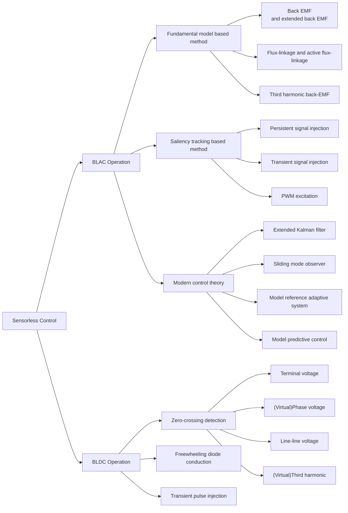
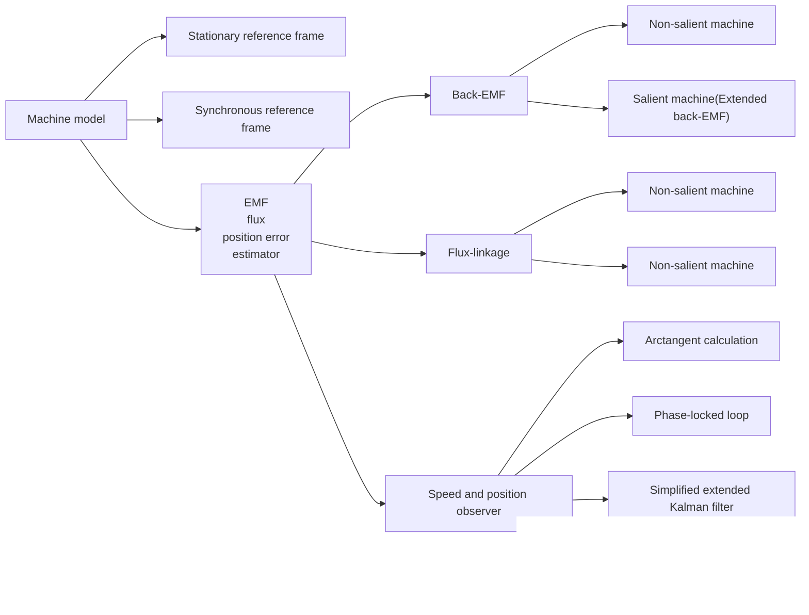

# Sensorless control methods
## overview

```mermaid
    flowchart LR
        A[Sensorless Control] --> B[BLAC Operation]
        A[Sensorless Control] --> C[BLDC Operation]

        B[BLAC Operation] --> D[Fundamental model based method]
        D[Fundamental model based method] --> D01["Back EMF <br> and extended back EMF"]
        D[Fundamental model based method] --> D02[Flux-linkage and active flux-linkage]
        D[Fundamental model based method] --> D03[Third harmonic back-EMF]

        B[BLAC Operation] --> E[Saliency tracking based method]
        E[Saliency tracking based method] --> E01[Persistent signal injection]
        E[Saliency tracking based method] --> E02[Transient signal injection]
        E[Saliency tracking based method] --> E03[PWM excitation]

        B[BLAC Operation] --> F[Modern control theory]
        F[Modern control theory] --> F01[Extended Kalman filter]
        F[Modern control theory] --> F02[Sliding mode observer]
        F[Modern control theory] --> F03[Model reference adaptive system]
        F[Modern control theory] --> F04[Model predictive control]

        C[BLDC Operation] --> G[Zero-crossing detection] 
        G[Zero-crossing detection]  --> G_01[Terminal voltage] 
        G[Zero-crossing detection]  --> G_02["(Virtual)Phase voltage"] 
        G[Zero-crossing detection]  --> G_03[Line-line voltage] 
        G[Zero-crossing detection]  --> G_04["(Virtual)Third harmonic"] 
        C[BLDC Operation] --> H[Freewheeling diode conduction] 
        C[BLDC Operation] --> I[Transient pulse injection] 
```

```mermaid
    flowchart LR
        A[Machine model] --> A1[Stationary reference frame]
        A[Machine model] --> A2[Synchronous reference frame]
        A[Machine model] --> B["EMF<br>flux<br>position error<br>estimator"]

        B["EMF<br>flux<br>position error<br>estimator"] --> B_1[Back-EMF]
        B_1[Back-EMF] --> B_1_1[Non-salient machine]
        B_1[Back-EMF] --> B_1_2["Salient machine(Extended back-EMF)"]
        B["EMF<br>flux<br>position error<br>estimator"] --> B_2[Flux-linkage]
        B_2[Flux-linkage] --> B_2_1[Non-salient machine]
        B_2[Flux-linkage] --> B_2_2[Non-salient machine]
        B["EMF<br>flux<br>position error<br>estimator"] --> C[Speed and position observer]

        C[Speed and position observer] --> C_1[Arctangent calculation]
        C[Speed and position observer] --> C_2[Phase-locked loop]
        C[Speed and position observer] --> C_3[Simplified extended Kalman filter]
        C[Speed and position observer] --> D[Practical issues] 
```
   