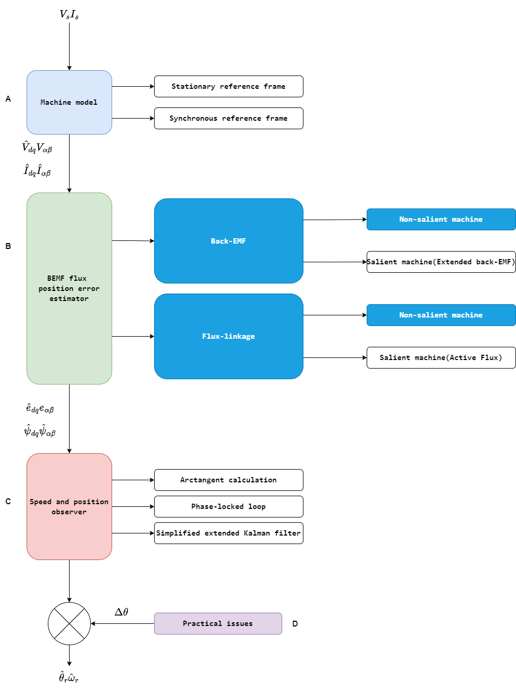

contents:  
[1. Sensorless control methods](#1-sensorless-control-methods)
- [1. Sensorless control methods](#1-sensorless-control-methods)
  - [1.1. Introduction](#11-introduction)
  - [1.2. Flux-Linkage-Based Method](#12-flux-linkage-based-method)
    - [1.2.1. Flux-Linkage Method for Non-salient PMSMs](#121-flux-linkage-method-for-non-salient-pmsms)
    - [1.2.2. Active Flux-Linkage Method for Salient PMSMs](#122-active-flux-linkage-method-for-salient-pmsms)
  - [1.3. Back-EMF-Based Method](#13-back-emf-based-method)
    - [1.3.1. Back-EMF Method for Non-salient PMSMs](#131-back-emf-method-for-non-salient-pmsms)
    - [1.3.2. Extended Back-EMF Method for Salient PMSMs](#132-extended-back-emf-method-for-salient-pmsms)
      - [1.3.2.1. In Synchronous Reference Frame](#1321-in-synchronous-reference-frame)
      - [1.3.2.2. In Stationary Reference Frame](#1322-in-stationary-reference-frame)
    - [1.3.3. Comparison](#133-comparison)
  - [1.4. Position Observer](#14-position-observer)
    - [1.4.1. Arctangent Method](#141-arctangent-method)
    - [1.4.2. Phase-Locked Loop](#142-phase-locked-loop)
    - [1.4.3. Simplified Extended Kalman Filter](#143-simplified-extended-kalman-filter)
# 1. Sensorless control methods
## 1.1. Introduction



## 1.2. Flux-Linkage-Based Method
### 1.2.1. Flux-Linkage Method for Non-salient PMSMs

$$
\begin{bmatrix}
 \psi_{\alpha}\\
 \psi_{\beta}\\
\end{bmatrix} =
\begin{bmatrix}
 L_\alpha&0\\
 0&L_\beta\\
\end{bmatrix}
 +
\begin{bmatrix}
 \psi_{m\alpha}\\
 \psi_{m\beta}\\
\end{bmatrix}
,
\begin{bmatrix}
 \psi_{m\alpha}\\
 \psi_{m\beta}\\
\end{bmatrix}
=\psi_{m}
\begin{bmatrix}
 cos\theta_{r}\\
 sin\theta_{r}\\
\end{bmatrix}
\tag{2.1}$$

$$
\theta_r =
tan^{-1}\frac{\psi_{\beta}-L_{s}*i_{\beta}}{\psi_{\alpha}-L_{s}*i_{\alpha}} =
tan^{-1}\frac{\psi_{m\beta}}{\psi_{m\alpha}}
\tag{2.2}$$
$$
\psi_{\alpha}
=\int(V_{\alpha}-i_{\alpha}*R_s)*dt \\
\psi_{\beta}
=\int(V_{\beta}-i_{\beta}*R_s)*dt 
\tag{2.3}$$
### 1.2.2. Active Flux-Linkage Method for Salient PMSMs
$$
\begin{bmatrix}
 \psi_{\alpha}\\
 \psi_{\beta}\\
\end{bmatrix} =
\begin{bmatrix}
    L_{sa}+L_{sd}cos(2\theta_r)    &   L_{sa}sin(2\theta_r)         \\
    L_{sa}sin(2\theta_r)           &   L_{sa}-L_{sd}cos(2\theta_r)  \\
\end{bmatrix}
\begin{bmatrix}
 i_{\alpha}\\
 i_{\beta}\\
\end{bmatrix}
 +\psi_m
\begin{bmatrix}
 \cos{\theta_r}\\
 \sin{\theta_r}\\
\end{bmatrix}
\tag{2.4}$$
$$
L_{sa}=\frac{L_q+L_d}{2}\\
L_{sd}=\frac{L_q-L_d}{2}
$$
$$
\psi_{a}=\psi_m+(L_d-L_q)i_d
\tag{2.5}$$
$$
\begin{bmatrix}
    \psi_{\alpha}\\
    \psi_{\beta}\\
\end{bmatrix} =
\begin{bmatrix}
    L_q    &   0    \\
    0      &   L_d  \\
\end{bmatrix}
\begin{bmatrix}
 i_{\alpha}\\
 i_{\beta}\\
\end{bmatrix}
 +\psi_a
\begin{bmatrix}
 \cos{\theta_r}\\
 \sin{\theta_r}\\
\end{bmatrix}
\tag{2.6}$$

$$
\theta_{r}
=tan^{-1}\frac{\psi_\beta-L_q*i_\beta}{\psi_\alpha-L_q*i_\alpha}
\tag{2.7}$$

```math
\begin{bmatrix}
    \psi_{d}\\
    \psi_{q}\\
\end{bmatrix} =
\begin{bmatrix}
    L_q    &   0    \\
    0      &   L_d  \\
\end{bmatrix}
\begin{bmatrix}
 i_{d}\\
 i_{q}\\
\end{bmatrix}
 +
\begin{bmatrix}
 \psi_{a}\\
 0\\
\end{bmatrix}
\tag{2.8}
```
```math
\begin{bmatrix}
    \hat{\psi}_{d}\\
    \hat{\psi}_{q}\\
\end{bmatrix} =
\begin{bmatrix}
    L_q    &   0    \\
    0      &   L_d  \\
\end{bmatrix}
\begin{bmatrix}
 \hat{i}_{d}\\
 \hat{i}_{q}\\
\end{bmatrix}
 +\psi_{a}
\begin{bmatrix}
 cos\Delta\theta\\
 sin\Delta\theta\\
\end{bmatrix}
\tag{2.9}
```
## 1.3. Back-EMF-Based Method
```math
\begin{bmatrix}
    e_{\alpha}\\
    e_{\beta}\\
\end{bmatrix} =
\begin{bmatrix}
 v_{\alpha}\\
 v_{\beta}\\
\end{bmatrix}-
\begin{bmatrix}
    R_s+pL_\alpha   &   0    \\
    0               &   R_s+pL_\beta  \\
\end{bmatrix}
\begin{bmatrix}
 i_{\alpha}\\
 i_{\beta}\\
\end{bmatrix}
 =\omega_r\psi_m
\begin{bmatrix}
 -sin\theta_r\\
 cos\theta_r\\
\end{bmatrix}
\tag{2.10}
```
### 1.3.1. Back-EMF Method for Non-salient PMSMs

```math
\begin{bmatrix}
    v_{d}\\
    v_{q}\\
\end{bmatrix} =
\begin{bmatrix}
    R_s+pL_s       &   -\omega_rL_s    \\
    \omega_rL_s    &   R_s+pL_s  \\
\end{bmatrix}
\begin{bmatrix}
 i_{d}\\
 i_{q}\\
\end{bmatrix}+
\begin{bmatrix}
 0\\
 \omega_r\psi_m\\
\end{bmatrix}
\tag{2.11}
```
```math
\begin{bmatrix}
    \hat{v}_{d}\\
    \hat{v}_{q}\\
\end{bmatrix} =
\begin{bmatrix}
    R_s+pL_s       &   -\omega_rL_s    \\
    \omega_rL_s    &   R_s+pL_s  \\
\end{bmatrix}
\begin{bmatrix}
 \hat{i}_{d}\\
 \hat{i}_{q}\\
\end{bmatrix}+
\begin{bmatrix}
 \hat{E}_{d}\\
 \hat{E}_{q}\\
\end{bmatrix}
,
\begin{bmatrix}
 \hat{E}_{d}\\
 \hat{E}_{q}\\
\end{bmatrix}
=\omega_r\psi_m
\begin{bmatrix}
 -sin\Delta\theta\\
 cos\Delta\theta\\
\end{bmatrix}
\tag{2.12}
```
```math
\Delta\hat{\theta}=tan^{-1}(-\frac{\hat{E}_d}{\hat{E}_q})\approx -\frac{\hat{E}_d}{\hat{E}_q}
\tag{2.13}
```


### 1.3.2. Extended Back-EMF Method for Salient PMSMs
#### 1.3.2.1. In Synchronous Reference Frame
```math
\begin{bmatrix}
    v_{d}\\
    v_{q}\\
\end{bmatrix} =
\begin{bmatrix}
    R_s+pL_d        &   -\omega_rL_q  \\
    \omega_rL_d     &   R_s+pL_q      \\
\end{bmatrix}
\begin{bmatrix}
 i_{d}\\
 i_{q}\\
\end{bmatrix}+
\begin{bmatrix}
 0\\
 \omega_r\psi_m\\
\end{bmatrix}
\tag{2.14}
```
```math
\begin{bmatrix}
    v_{d}\\
    v_{q}\\
\end{bmatrix} =
\begin{bmatrix}
    R_s+pL_d        &   -\omega_rL_q  \\
    \omega_rL_d     &   R_s+pL_q      \\
\end{bmatrix}
\begin{bmatrix}
 i_{d}\\
 i_{q}\\
\end{bmatrix}+
\begin{bmatrix}
 0\\
 E_{ex}\\
\end{bmatrix}
\tag{2.15}
```
```math
 E_{ex}=\omega_r\psi_m+(L_d-L_q)(\omega_ri_d-pi_q)
\tag{2.16}
```

```math
\begin{bmatrix}
    \hat{v}_{d}\\
    \hat{v}_{q}\\
\end{bmatrix} =
\begin{bmatrix}
    R_s+pL_d        &   -\omega_rL_q  \\
    \omega_rL_d     &   R_s+pL_q      \\
\end{bmatrix}
\begin{bmatrix}
 \hat{i}_{d}\\
 \hat{i}_{q}\\
\end{bmatrix}+
\begin{bmatrix}
 \hat{E}_{ex,d}\\
 \hat{E}_{ex,q}\\
\end{bmatrix}
\tag{2.17}
```
```math
\begin{bmatrix}
  \hat{E}_{ex,d}\\
  \hat{E}_{ex,q}\\
\end{bmatrix} =\hat{E}_{ex}
\begin{bmatrix}
    -sin\Delta\theta \\
    cos\Delta\theta \\
\end{bmatrix}+\Delta\omega L_q
\begin{bmatrix}
 \hat{i}_{d}\\
 -\hat{i}_{q}\\
\end{bmatrix}
\tag{2.18}
```

```math
\Delta\hat{\theta}=tan^{-1}(-\frac{\hat{E}_{ex,d}}{\hat{E}_{ex,q}})\approx -\frac{\hat{E}_{ex,d}}{\hat{E}_{ex,q}}
\tag{2.19}
```
#### 1.3.2.2. In Stationary Reference Frame
```math
\begin{bmatrix}
    {v}_{\alpha}\\
    {v}_{\beta}\\
\end{bmatrix} =
\begin{bmatrix}
    R_s+pL_d        &   -\omega_r(L_q-L_d)  \\
    \omega_r(L_q-L_d)     &   R_s+pL_q      \\
\end{bmatrix}
\begin{bmatrix}
  {i}_{\alpha}\\
  {i}_{\beta}\\
\end{bmatrix}+
\begin{bmatrix}
 {e}_{ex,\alpha}\\
 {e}_{ex,\beta}\\
\end{bmatrix}
\tag{2.20}
```
```math
\begin{bmatrix}
  {e}_{ex,\alpha}\\
 {e}_{ex,\beta}\\
\end{bmatrix} ={E}_{ex}
\begin{bmatrix}
    -sin\theta \\
    cos\theta \\
\end{bmatrix}
\tag{2.21}
```

```math
{\theta_r}=tan^{-1}(-\frac{{e}_{ex,\alpha}}{{e}_{ex,\beta}})
\tag{2.22}
```
### 1.3.3. Comparison
## 1.4. Position Observer
### 1.4.1. Arctangent Method
```math
{\theta_r}=tan^{-1}(-\frac{{e}_{\alpha}}{{e}_{\beta}}),
{\theta_r}=tan^{-1}(-\frac{{\psi}_{\alpha}}{{\psi}_{\beta}})
\tag{2.23}
```
### 1.4.2. Phase-Locked Loop
### 1.4.3. Simplified Extended Kalman Filter